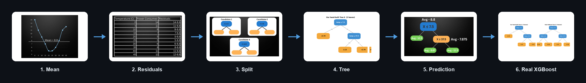

# XGBoost From Scratch

**A hands-on, numbers-first walkthrough of how XGBoost actually works.** We work out residuals, similarity scores, gain, learning rate, and regularization by hand on a tiny dataset. Then we verify everything against the real `xgboost` library.

> 📺 Companion repo for **[XGBoost Explained: How the Algorithm Actually Works (Step-by-Step)](https://youtu.be/Y0EJQFj0foo)** by Schovia Labs.

**Most tutorials show `model.fit()`. This repo shows the actual numbers XGBoost computes before it ever fits a model.**

> [!TIP]
> **By the end, you will be able to explain:**
> 1. Why XGBoost starts with a base prediction
> 2. How residuals become the target for the next tree
> 3. How similarity score and gain choose a split
> 4. What learning rate, gamma, and lambda actually do
> 5. Why real XGBoost may build a slightly different tree than the hand demo

- **Level:** beginner-friendly, but assumes basic Python and decision-tree intuition
- **Time:** 30 to 45 minutes
- **Setup:** none. Open directly in Colab

---

## Why this repo exists

Most XGBoost explainers wave their hands at "gradient boosting" and jump straight to `model.fit()`. This repo does the opposite. It recomputes every number XGBoost would compute internally, by hand, on a dataset small enough to fit in your head. That way the algorithm stops being a black box.

If you've ever wondered *what a similarity score actually is*, *why gain decides a split*, or *what lambda and gamma are doing to your leaves*, this is for you.

## The example

We predict a building's power consumption from outdoor temperature. It's a single feature and a handful of points, plotted as temperature (x) vs. power consumed (y). Small enough to trace by hand. Complex enough to show every mechanic that matters at scale.

## What's covered

- **The basics:** classification vs. regression, and why decision trees can do both
- **Boosting vs. Random Forest:** trees grown in parallel and averaged vs. trees grown in sequence, each fixing what the last one got wrong
- **Part 1, gradient boosting:** computing the mean, residuals, similarity score, and gain by hand to pick the best split (walking through candidate thresholds 2.5, 7.5, 12.5, and growing the tree a second level)
- **Part 2, learning rate (eta, also called shrinkage):** how a tree makes a prediction, and why scaling each tree's correction (eta = 0.5, eta = 0.2) trades speed for safety
- **Part 3, tree capacity and stopping:** max depth or max leaves, gamma as a minimum-gain bar for splitting, and early stopping on a validation metric
- **Part 4, regularization (lambda):** how lambda shrinks similarity and leaf values toward zero, how gamma acts as a toll on gain, and why together they keep trees modest
- **What makes it "Extreme"**: curvature-aware splits, built-in regularization, native handling of missing/sparse data, and the speed optimizations that make it viable on large datasets

## Run it yourself

**[`xgboost_from_scratch.ipynb`](./xgboost_from_scratch.ipynb)** reproduces every number from the video on the exact same dataset: mean → residuals → similarity → gain → splits → learning rate → regularization. Then it checks the result against the real `xgboost` library. Click the **Open in Colab** badge above. No setup needed.

**[`index.html`](./index.html)** is a scroll-through visual explainer covering the same steps. It uses small interactive widgets (drag the learning-rate, gamma, and lambda sliders yourself) instead of code cells. Open it directly in a browser, or run `python3 -m http.server` from this folder.

## Status

- [x] Concept walkthrough (this README)
- [x] Notebook reproducing the worked example by hand (residuals → similarity → gain → splits)
- [x] Same example verified against real `xgboost` output
- [x] Video screenshots embedded at each matching step
- [x] Reality check: real XGBoost trees (exact search, depthwise growth, `hist` binning, `lossguide`) plotted and reconciled against our hand-built tree
- [x] Scroll-through interactive explainer (`index.html`) with live sliders for η, γ, and λ

## Support this project

If this helped XGBoost click for you, a ⭐ on this repo goes a long way. It's how other people searching for "how does XGBoost actually work" find it too.

- ⭐ Star this repo
- 📺 [Watch the full video](https://youtu.be/Y0EJQFj0foo) and subscribe to **Schovia Labs**
- 🔁 Share it with someone learning gradient boosting

## Related

- [Decision trees](https://youtu.be/343ks0O3EkQ), the video referenced above
